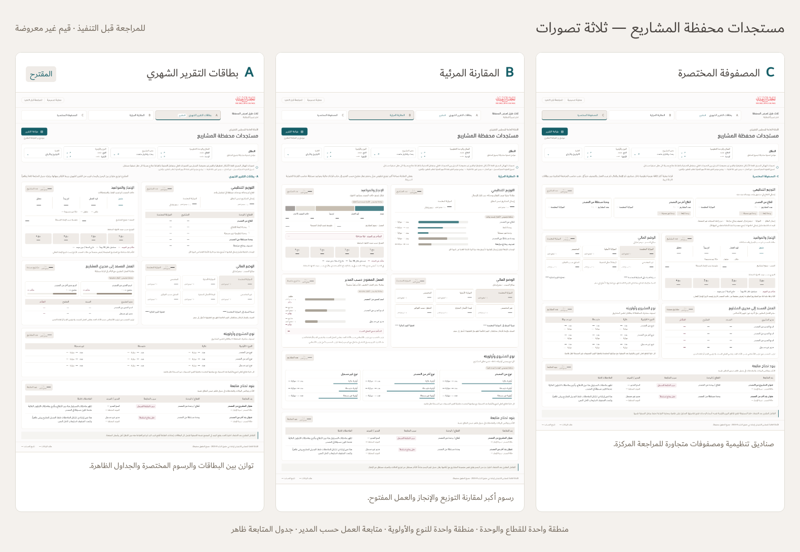

# Projects portfolio: design concepts for approval

These are design previews for **مستجدات محفظة المشاريع**, not a new production release. Performance App v115 remains unchanged. [Download the preview ZIP](./Portfolio-Design-Concepts.zip?raw=true). Extract the preview ZIP and open `index.html` to switch between the three directions.

The previews use the monthly dashboard's Arabic typography, white cards, beige quarters and restrained teal/burgundy palette. Chart shapes are schematic and values are placeholders; they do not represent organizational performance or imported workbook records. Filter and report controls illustrate placement; only the concept navigation is operational.

[Comparison board](./Concepts-Comparison.png) · [A full preview](./Concept-A.png) · [B full preview](./Concept-B.png) · [C full preview](./Concept-C.png)

## Three directions

| Concept | Direction | Intended benefit |
| --- | --- | --- |
| A — بطاقات التقرير الشهري | Balanced cards, readings and focused charts | Closest continuation of the monthly report; recommended starting point |
| B — المقارنة المرئية | Charts lead the organization, delivery and workload comparisons | Easier visual comparison across groups |
| C — المصفوفة المختصرة | Compact boxes and aligned comparison cells | Efficient scanning for frequent portfolio review |

All three retain the same reporting areas and data definitions. The choice concerns presentation and reading order rather than a change in calculations.

All directions include:

- One organization area, with sector summaries and organizational units in the same hierarchy. Parent subtotals and child details are views of the same projects and must not be added together.
- Delivery/status readings, completion percentage, date windows and four separate beige quarter boxes.
- A finance area that retains separate source fields and does not equate spending with achievement.
- A manager workload area showing assignments, dates and delays, without ranking competence or inventing capacity thresholds.
- One combined priority/type area, showing counts and budgets. A true cross-tab will be computed from selected project records, not from the two existing marginal totals.
- A visible issues/delays table with complete source notes.

The intended implementation will retain searchable multi-select filters, the selected calculation date, exact snapshot connections and the same scope across charts, tables, drilldowns and printing. Change arrows require valid confirmed history; unchanged indicators remain blank. Zero displays as an ASCII dash while unavailable values remain distinct. Budget charts disclose incomplete numeric coverage.

The user will choose a direction before production implementation. No source workbook, imported project records, personal names or private audit evidence are included in these previews.

## Preview verification

Independent visual review passed for all three concepts at desktop, tablet and mobile widths. Each retains one organizational area, one combined classification area, the five reporting areas and a visible follow-up table. Concept switching, browser back and keyboard skip-to-content passed. No page overflow, double vertical scrolling, runtime errors or external requests were observed. The standalone-unit repetition and skip-link reset found in review were fixed and rechecked.

The preview ZIP passed CRC, clean extraction, byte-for-byte asset checks and a browser startup/keyboard check of the extracted package. Native file opening was not run: managed Chromium blocks file URLs. Filter and print operation are not implemented in these design sketches; their locations and intended behavior are shown for review. Performance App v115 is unchanged.

Preview ZIP SHA-256: `25c1164febfc61bb86ca048c7166fb4e33c2981ec6d2632a9a8f3ccc05c52b1b`.
